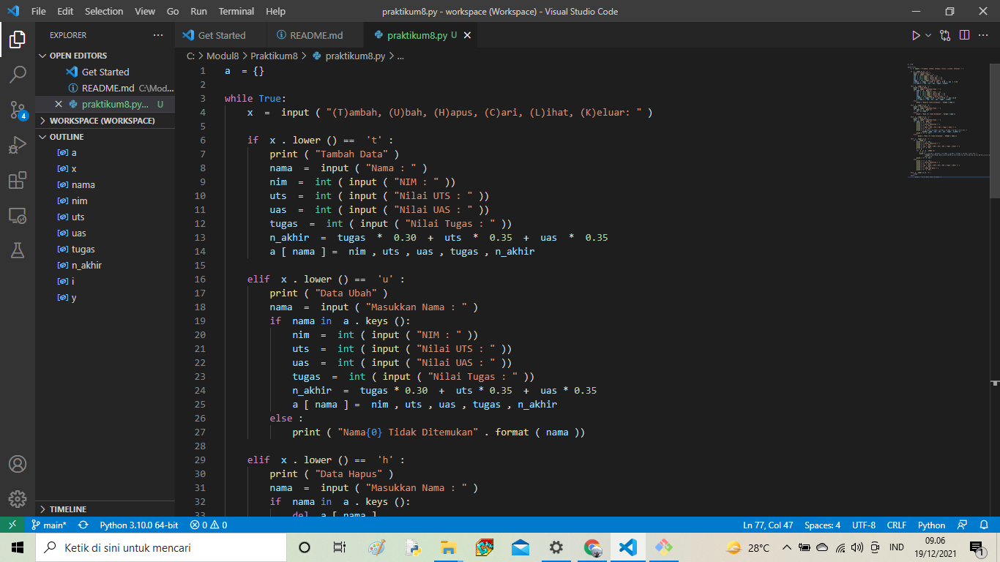
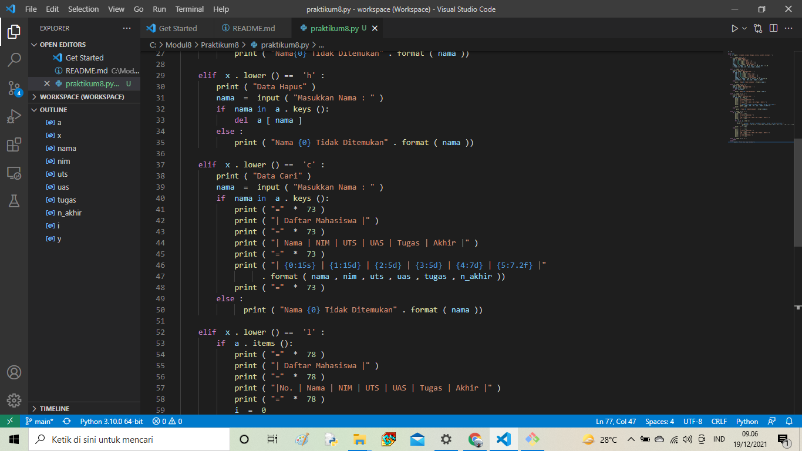
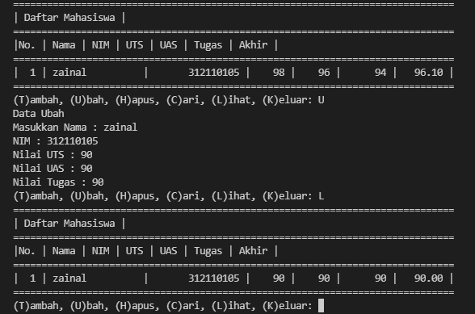

# Praktikum8

Nama : Zainal Abidin

Kelas : TI 21 C1

NIM : 312110105

# Codingannya 

# Penjelasannya

-Dengan penjelasan kode sumber sebagai berikut: -Kode di bawah ini untuk membuat kamus kosong, untuk menampung kamus 

dengan menggunakan tuple

a = {}

-Kode di bawah ini untuk perulangan while, dan juga untuk menginisialkan penambahan menu pilihan Tambah, Ubah, Hapus,

 Cari, Lihat dan Keluar:

sedangkan Benar :

 x  =  input ( "(T)ambah, (U)bah, (H)apus, (C)ari, (L)ihat, (K)eluar: " )

-Kode di bawah adalah untuk sintaks penambahan data, dengan ketentuan jika kita mengetikkan 't' pada keyboard, maka 

akan melakukan penambahan data dan ditampung ke dalam kamus 'a' yang telah kita buat, dengan nama sebagai tombol, dan 

yang lainnya sebagai nilai

jika x . lower () == 't' : 

print ( "Tambah Data" ) 

nama = input ( "Nama : " ) 

nim = int ( input ( "NIM : " )) 

uts = int ( input ( "Nilai UTS : " )) 

uas = int ( input ( "Nilai UAS : " ))

tugas = int ( input( "Nilai Tugas : " )) 

n_akhir = tugas * 0.30 + uts * 0.35 + uas * 0.35 a [ nama ] = nim , uts , uas , tugas , n_akhir

-Kode di bawah adalah untuk sintaks mengubah data, dengan ketentuan jika kita mengetikkan 'u' pada keyboard, maka akan 

melakukan perubahan data yang telah ditampung ke dalam kamus 'a' yang telah kita buat, tetapi data yang dapat diubah 

hanya data yang berupa nilai nya saja

elif x . rendah () == 'u' : 

print ( "Ubah Data" ) 

nama di = masukan ( "Masukkan Nama:" ) 

jika nama di dalam sebuah . kunci (): 

nim = int ( masukan ( "NIM : " )) 

uts = int ( masukan ( "Nilai UTS : " )) 

uas = int ( masukan ("Nilai UAS : " )) 

tugas = int ( input ( " Nilai Tugas : " )) 

n_akhir = tugas * 0.30 + uts * 0.35 + uas * 0.35 a [ nama ] = nim , uts , uas , tugas , n_akhir else : print ( "Nama

{0} Tidak Ditemukan" . format ( nama ))

-Kode di bawah adalah untuk menghapus data sintaks, dengan ketentuan jika kita mengetikkan 'h' pada keyboard, maka 

akan menghapus data yang telah kita masukkan ke dalam kamus 'a' yang telah kita buat dengan pernyataan del a[nama]

elif x . menurunkan () == 'h' : 

print ( "Hapus Data" ) 

nama di = masukan ( "Masukkan Nama:" ) 

jika nama di dalam sebuah . keys (): 

del a [ nama ] else : 

print ( "Nama {0} Tidak Ditemukan" . format ( nama ))

Kode di bawah adalah untuk sintaks data, dengan ketentuan jika kita mengetikkan 'c' pada keyboard, maka akan melakukan

 pencarian data dengan memasukkan kunci dari data yang telah kita masukkan ke dalam kamus 'a' yang telah kita buat

elif x . menurunkan () == 'c' : 

print ( "Cari Data" ) 

nama di = masukan ( "Masukkan Nama:" ) 

jika nama di dalam sebuah . kunci (): 

print ( "=" * 73 ) 

print ( "| Daftar Mahasiswa |" ) 

print ( "=" * 73 ) print ("| Nama | NIM | UTS | UAS | Tugas | Akhir |" ) 

print ( "=" * 73 ) print ( "| {0:15s} | {1:15d} | {2:5d} | {3:5d} | {4:7d} | {5:7.2f} | " . Format ( nama di , nim , UTS , uas , Tugas , n_akhir )) 

print ( = "" * 73 ) lain : 

print ( "Nama {0} tidak ditemukan" . Format (nama ))

-Kode di bawah adalah untuk melihat data sintaks, dengan ketentuan jika kita mengetikkan 'l' pada keyboard, maka akan 

menampilkan keseluruhan dari data yang telah kita masukkan dan ditampung ke dalam kamus 'a' yang telah kita buat

elif x . lower () == 'l' : 

jika a . item (): print ( "=" * 78 ) 

print ( "| Daftar Mahasiswa |" ) 

print ( "=" * 78 ) 

print ( "|No. | Nama | NIM | UAS | Tugas | Akhir |" ) 

cetak ( "=" = 0 untuk y di sebuah . item (): i += 1 

print ( "| {no:2d} | {0:15s} | {1:15d} | {2:5d} | {3:5d} | {4:7d} | {5 :7.2f} |" . format ( y [ 0 ][: 13 ], y [ 1 ][ 0 ], y [ 1 ][ 1 ], y [ 1 ][ 2 ], y [ 1 ][ 3 ], y [ 1][ 4 ], no = i )) print ( "=" * 78 )

-Kode di bawah adalah untuk menampilkan 'TIDAK ADA DATA', jika kita belum pernah memasukkan data ke dalam kamus 'a'

lain : print ( "=" * 78 ) 

print ( "| Daftar Mahasiswa |" ) 

print ( "=" * 78 ) print ( "|No. | Nama | NIM | UTS | Tugas | Akhir |" ) 

print ( "=" * 78 ) print ( "| TIDAK ADA DATA |") cetak ( "=" * 78 )

-sedangkan kode di bawah adalah untuk sintaks keluar dari program, untuk menghentikan program, dengan ketentuan jika 

kita mengetikkan 'k' pada keyboard, maka akan keluar dari program tersebut

elif x . lower () == 'k' : break

-Dan kode yang terakhir adalah untuk sintaks jika kita mengetikkan pada keyboard selain dari huruf yang telah 

didefinisikan di atas seperti 't', 'u', 'h', 'c', 'l', dan 'k', maka akan menampilkan Pilih Menu Yang Tersedia

else :

 print ( "Pilih Menu Yang Tersedia" )

 # Menambahkan data dan menampilkan data

 

 # Menghapus data 

 

 # Mengubah data

 

 # Flowchartnya

 